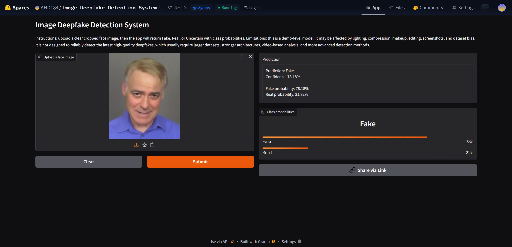
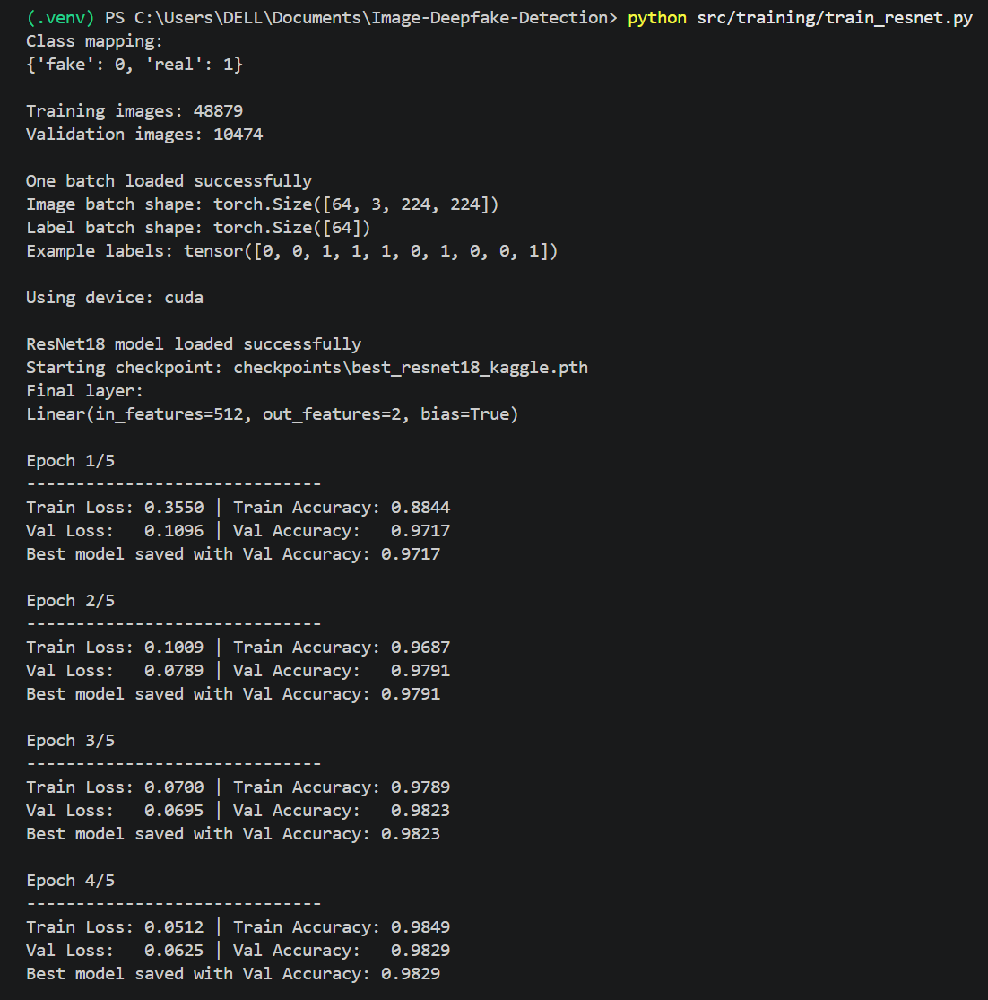
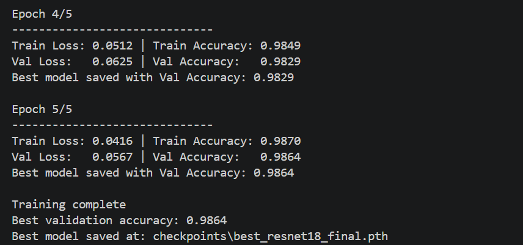
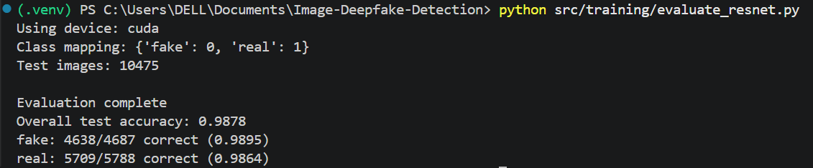

# Image Deepfake Detection System

A face-based image deepfake detection project built with **PyTorch**, **ResNet18**, and **Gradio**.

**Live Demo:**  
https://huggingface.co/spaces/AHD184/Image_Deepfake_Detection_System

---

## Overview

This project is an end-to-end deepfake image detection system that classifies uploaded face images as **Fake**, **Real**, or **Uncertain**. It uses a ResNet18-based transfer learning model trained on real and fake face datasets, and the final model is deployed through a public Gradio web app on Hugging Face Spaces.

The main goal of this project was to build a complete machine learning pipeline rather than only train a model. The project includes dataset preparation, preprocessing, training, evaluation, single-image inference, and public deployment.

---

## Demo

The deployed app allows users to upload a face image and receive:

- a predicted class: Fake, Real, or Uncertain
- fake probability
- real probability
- confidence score



---

## Features

- Image upload interface using Gradio
- Fake / Real / Uncertain prediction
- Class probability display
- ResNet18 transfer learning model
- PyTorch training and evaluation pipeline
- Public Hugging Face Spaces deployment
- Dataset preparation scripts for multiple datasets
- Separate inference script for testing individual images

---

## Project Pipeline

The project was developed in stages:

1. Collected and organized real/fake face datasets
2. Extracted frames and cropped faces from video-based data
3. Built train/validation/test splits
4. Trained a ResNet18 binary classifier using transfer learning
5. Evaluated the model on held-out test data
6. Tested the model on external images
7. Built a Gradio app for image upload and prediction
8. Deployed the app publicly on Hugging Face Spaces

---

## Model

The model is based on **ResNet18**, a convolutional neural network pretrained on ImageNet. The original ImageNet classification layer was replaced with a two-output layer:

```text
0 = fake
1 = real
```

ResNet18 was chosen because it is lightweight, simple to deploy, and suitable for building a complete deep learning pipeline. It is a basic architecture compared to modern deepfake detection systems.

---

## Datasets Used

Several datasets were explored during development:

- FaceForensics++ real/fake video data
- A large Kaggle real/fake face image dataset ~ 140k images in total
- HiDF high-quality real/fake image dataset ~ 70k images in total

The datasets are not included in this repository because of size and licensing restrictions. Instead, this repository contains scripts used to organize, clean, and split the data.

---

## Training and Evaluation

The model was trained using transfer learning with ResNet18. The final training setup used:

- resized 224 × 224 face images
- ImageNet normalization
- cross-entropy loss
- Adam optimizer
- train/validation/test split

Example training output:





Example evaluation output:



The model achieved strong results on the held-out dataset split. However, external testing showed that high test accuracy does not always mean the model will generalize perfectly to random internet images. This became one of the most important findings of the project.

---

## Issues Faced and What I Learned

A major part of this project was understanding why the model behaved differently across datasets.

The first model was trained on a smaller FaceForensics-style dataset. It showed very high validation accuracy, but it generalized very poorly to external images, as the faces used to train the model were outdated. This suggested that the validation split was too easy and that the model may have seen very similar images during training and validation.

A later model trained on a large balanced Kaggle dataset performed better on fake images, but it became too aggressive and often predicted polished real images as fake. This showed that the model was learning shortcuts from the dataset.

During testing, the model seemed sensitive to image style. Images with smooth skin, heavy makeup, strong editing, perfect lighting, or high-quality studio appearance were sometimes classified incorrectly. This is likely because the model learned patterns related to image quality and editing style rather than only deepfake-specific elements.

To reduce this, the final training used a high-quality dataset and added augmentations such as color jitter, horizontal flipping, and slight blur. These steps improved the training pipeline, but they do not fully solve the generalization problem.

This was an important lesson: deepfake detection is not only about training a classifier. Dataset quality, preprocessing, bias, and evaluation design matter a lot.

---

## Limitations

This project is a demo-level deepfake detection system, not an advanced verification tool.

The model may be affected by:

- lighting
- compression
- makeup
- skin smoothing
- image editing
- screenshots
- image resolution
- dataset bias
- images from sources very different from the training data

It is also not designed to reliably detect the latest high-quality deepfakes. Modern deepfake detection usually requires larger and more diverse datasets, stronger model architectures, better face alignment, frequency-domain analysis, and often video-based temporal features.

Because of these limitations, the app includes an **Uncertain** output for lower-confidence predictions. The prediction should be treated as a model output, not as proof that an image is real or fake.

---

## Repository Structure

```text
image-deepfake-detection/
│
├── app.py
├── README.md
├── requirements.txt
├── requirements-dev.txt
├── .gitignore
│
├── checkpoints/
│   ├── best_resnet18_final.pth
│   └── face_detector.task
│
├── screenshots/
│   ├── app_demo.png
│   ├── evaluation_output.png
│   ├── training_output_1.png
│   └── training_output_2.png
│
└── src/
    ├── data/
    │   ├── build_dataset.py
    │   ├── build_kaggle_dataset.py
    │   ├── build_hidf_dataset.py
    │   ├── crop_fake_faces.py
    │   ├── crop_real_faces.py
    │   ├── extract_fake_frames.py
    │   └── extract_frames.py
    │
    ├── training/
    │   ├── train_resnet.py
    │   └── evaluate_resnet.py
    │
    └── inference/
        └── predict_image.py
```

---

## Running the App Locally

Clone the repository:

```bash
git clone https://github.com/AHD184/image-deepfake-detection.git
cd image-deepfake-detection
```

Create a virtual environment:

```bash
python -m venv .venv
```

Activate it on Windows PowerShell:

```bash
.venv\Scripts\activate
```

Install the app requirements:

```bash
pip install -r requirements.txt
```

Run the Gradio app:

```bash
python app.py
```

The app will open locally at:

```text
http://127.0.0.1:7860
```

---

## Future Work

Possible improvements include:

- using stronger architectures 
- training on more diverse modern real and fake images
- evaluating on more external datasets
- improving calibration of confidence scores
- using video-based detection instead of single-image classification
- testing fairness across different lighting, makeup, skin texture, and image styles

---

## Live App

The public demo is available here:

https://huggingface.co/spaces/AHD184/Image_Deepfake_Detection_System
